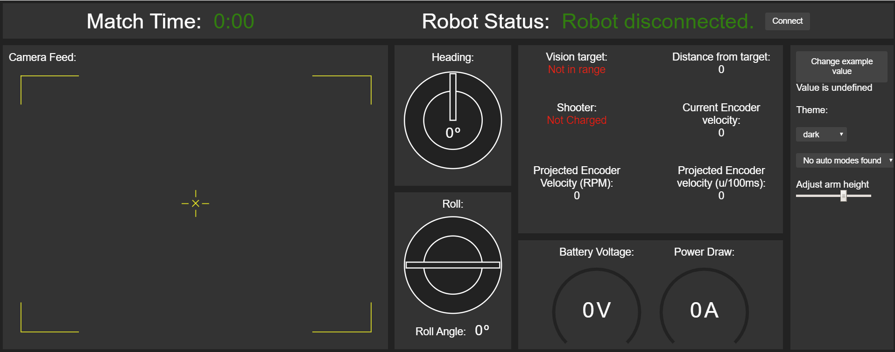

# FRC Dashboard

[Robot Code](https://github.com/6504/FRC-2020) | [Vision Code](https://github.com/6504/FRC-2020-Vision) | **Dashboard**

This is the code for Team 6504's 2020 dashboard, heavily based on the [FRC Dashboard](https://github.com/FRCDashboard/FRCDashboard) framework.

## Note

**Portions of code may be incomplete/unfinished, as the FRC 2020 season was cut short due to the COVID-19 pandemic.**

**Development of this code will be continued, but will be moved to a new repository.**

**- Chandi Kanhai**

## Setup

You'll need [`nodejs`](https://nodejs.org) & [`npm`](https://npmjs.com).

Before running your dashboard, you'll need to install the node dependencies by `cd`ing into the dashboard directory and running `npm install`.

### Configuration

* In `ui.js`, there are a bunch of key handler functions which controls the updating of control elements in the dashboard. Example NetworkTables key names are used, but you'll need to change them to match those used in your team's robot code for them to affect anything on your robot.

#### Camera feed

FRC Dashboard supports display of MJPG camera streams. Once you've created a stream (using WPILib's `CameraServer` class, [mjpg-streamer](https://robotpy.github.io/2016/01/14/mjpg-streamer-for-roborio/) (deprecated), or another method), update `style.css` to use the IP of your live camera feed. Usually this is something like `roborio-XXXX-frc.local:1181/?action=stream`, where `XXXX` is your team's number. The port increases based on camera number, for example, `1181` is Camera 1, and `1182` is Camera 2. **Note:** not every robot follows this rule. Your port may be `5800` or something else.

## Building

Some users may wish to compile their dashboard applications into standalone `.exe` or `.app` files.

Assuming the necessary setup steps have been performed, users may run `npm run package-[platform]`, where `[platform]` is `linux`, `mac`, or `win` according to the target platform, to pack the entire application into a single executable.

## Running

Connect to your robot's network if you haven't already. (If you're just testing the dashboard and don't currently need to use it with your robot, you can skip this step.)

While in the dashboard directory, run:

    npm start

This will open the dashboard application. Note that you can refresh the page and client-side updates will take effect; reopening the whole application is usually unnecessary.

It is recommended that while using the dashboard on your driver station, you close the top panel of the FRC DriverStation to make room for the dashboard.

## Original Authors

* [Erik Boesen](https://github.com/ErikBoesen) is the primary developer of FRC Dashboard.
* [Team 1418](https://github.com/frc1418) used earlier versions of this code in 2015 and 2016.
* [Leon Tan](https://github.com/lleontan) led the original 1418 UI team, coded `pynetworktables2js`, and developed a browser-based UI which was years later reworked to create FRC Dashboard.
* [Dustin Spicuzza](https://github.com/virtuald) leads the [RobotPy](https://github.com/robotpy) project, and mentored Team 1418 through much of FRC Dashboard's genesis.
* [Tomas Rakusan](https://github.com/rakusan2) Developed Node based [NetworkTables client](https://github.com/rakusan2/FRC-NT-Client) and its interface in this project.

## Authors

* [Chandi Kanhai](https://github.com/Chandi-95) wrote the UI for the 2020 dashboard.

## Licensing

This software is available under the [MIT License](`LICENSE`).
